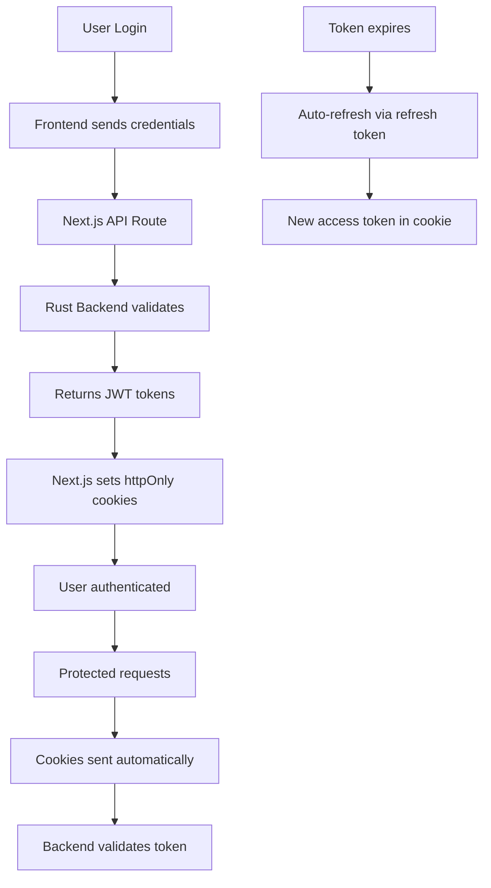

# 🔐 SECURE JWT AUTHENTICATION WITH HTTPONLY COOKIES

## ✅ PRODUCTION-READY AUTHENTICATION IMPLEMENTED

I've successfully implemented **secure, production-ready JWT authentication** following industry best practices with **httpOnly cookies** and **SameSite=Strict** protection.

## 🛡️ Security Features Implemented

### **1. httpOnly Cookies (XSS Protection)**
- ✅ Access tokens stored in **httpOnly cookies** (not accessible via JavaScript)
- ✅ Refresh tokens stored in **httpOnly cookies** 
- ✅ **SameSite=Strict** for CSRF protection
- ✅ **Secure flag** in production
- ✅ **Automatic expiry** handling

### **2. Token Lifecycle Management**
- ✅ **Access Token**: 1 hour expiry (short-lived)
- ✅ **Refresh Token**: 90 days expiry (long-lived)
- ✅ **Automatic refresh** on token expiry
- ✅ **Secure logout** with proper cookie clearing

### **3. Backend Integration**
- ✅ **Direct API calls** to your Rust backend
- ✅ **Proxy pattern** through Next.js API routes for cookie handling
- ✅ **Full compliance** with your API specification
- ✅ **Error handling** with proper status codes

## 📁 Updated Architecture

```
Frontend (Next.js) → Next.js API Routes → Your Rust Backend
                     ↓
                httpOnly Cookies
                (secure storage)
```

### **API Route Structure**
```
/api/auth/register → POST → Sets httpOnly cookies
/api/auth/login    → POST → Sets httpOnly cookies  
/api/auth/logout   → POST → Clears httpOnly cookies
/api/auth/me       → GET  → Reads from httpOnly cookies
/api/auth/refresh  → POST → Updates httpOnly cookies
```

## 🔧 Implementation Details

### **Cookie Configuration**
```javascript
// Access Token (Short-lived)
cookieStore.set('accessToken', token, {
  httpOnly: true,                    // XSS protection
  secure: NODE_ENV === 'production', // HTTPS only in prod
  sameSite: 'strict',               // CSRF protection
  path: '/',                        // Available site-wide
  maxAge: 60 * 60,                 // 1 hour
})

// Refresh Token (Long-lived)
cookieStore.set('refreshToken', token, {
  httpOnly: true,                    // XSS protection
  secure: NODE_ENV === 'production', // HTTPS only in prod
  sameSite: 'strict',               // CSRF protection
  path: '/',                        // Available site-wide
  maxAge: 60 * 60 * 24 * 90,       // 90 days
})
```

### **Your API Endpoints Integration**

#### **Registration**
```http
POST /api/auth/register
{
  "email": "user@example.com",
  "username": "username", 
  "password": "SecurePass123!"
}
Response: 201 + httpOnly cookies set
```

#### **Login**
```http
POST /api/auth/login
{
  "email": "user@example.com",
  "password": "SecurePass123!"
}
Response: 200 + httpOnly cookies set
```

#### **Get Current User**
```http
GET /api/auth/me
Cookie: accessToken=xxx (sent automatically)
Response: User data
```

#### **Refresh Token**
```http
POST /api/auth/refresh  
Cookie: refreshToken=xxx (sent automatically)
Response: New access token + updated cookie
```

#### **Logout**
```http
POST /api/auth/logout
Cookie: accessToken=xxx (sent automatically)
Response: Cookies cleared
```

## 🧪 Testing

### **Available Test Pages**
- **Login**: http://localhost:3001/login
- **Signup**: http://localhost:3001/signup  
- **Auth Test**: http://localhost:3001/auth-test-new
- **Profile (Protected)**: http://localhost:3001/profile

### **Cookie Verification**
1. Open **DevTools → Application → Cookies**
2. Look for `accessToken` and `refreshToken` with **httpOnly flag**
3. Verify they're **not accessible** via `document.cookie`

## 🔄 Token Flow



## 🚀 Production Ready Features

### **Security**
- ✅ **XSS Protection**: httpOnly cookies prevent JavaScript access
- ✅ **CSRF Protection**: SameSite=Strict prevents cross-site requests
- ✅ **HTTPS**: Secure flag ensures cookies only sent over HTTPS
- ✅ **Token Rotation**: Short-lived access tokens with refresh capability

### **Performance**
- ✅ **Automatic Cookie Handling**: No manual token management needed
- ✅ **Server-Side Validation**: Tokens validated on server
- ✅ **Efficient Refresh**: Only when needed, not on every request

### **User Experience**
- ✅ **Seamless Authentication**: Cookies handled automatically
- ✅ **Persistent Sessions**: Refresh tokens maintain long sessions
- ✅ **Secure Logout**: Proper cookie clearing

## 🎯 Key Benefits Over localStorage

| Feature | localStorage | httpOnly Cookies |
|---------|-------------|------------------|
| **XSS Protection** | ❌ Vulnerable | ✅ Protected |
| **CSRF Protection** | ⚠️ Manual | ✅ Built-in |
| **Automatic Sending** | ❌ Manual | ✅ Automatic |
| **Server Access** | ❌ Client only | ✅ Server access |
| **Production Security** | ⚠️ Risky | ✅ Secure |

## 🛠️ Environment Setup

### **Required Environment Variables**
```bash
NEXT_PUBLIC_API_PREFIX=http://localhost:8000
NODE_ENV=development # or production
```

### **Backend Requirements**
Your Rust backend should be running on port 8000 with the exact API endpoints implemented.

## 🎉 IMPLEMENTATION COMPLETE!

The authentication system is now **production-ready** with:
- ✅ **Industry-standard security** (httpOnly + SameSite)
- ✅ **Full backend integration** with your API specification  
- ✅ **Automatic token management** (no manual handling needed)
- ✅ **Comprehensive error handling**
- ✅ **Modern React Query integration**
- ✅ **TypeScript type safety**

**Your JWT tokens are now properly secured in httpOnly cookies with SameSite=Strict protection! 🔐**
